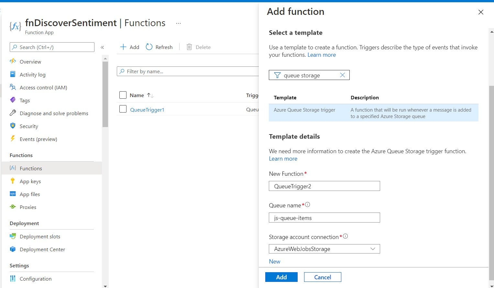

# Feedback Sorter using Azure Cognitive Services - Text Analytics API
Table of Contents
=================
<!-- TOC -->

- [Feedback Sorter using Azure Cognitive Services - Text Analytics API](#feedback-sorter-using-azure-cognitive-services---text-analytics-api)
    - [Problem Summary](#problem-summary)
    - [Solution](#solution)
        - [A solution based on Azure Functions, Azure Queue Storage, and Text Analytics API](#a-solution-based-on-azure-functions-azure-queue-storage-and-text-analytics-api)
        - [Steps to implement](#steps-to-implement)
            - [Step 0 - Create a Text Analytics API](#step-0---create-a-text-analytics-api)
                - [Testing Text Analytics API via Cognitive Services API Console](#testing-text-analytics-api-via-cognitive-services-api-console)
                - [Test Request and Response in API Console](#test-request-and-response-in-api-console)
            - [Step 1 - Create a Function App](#step-1---create-a-function-app)
            - [Step 2 - Add a function in the Function App created above](#step-2---add-a-function-in-the-function-app-created-above)
            - [Step 3 - Add Output Bindings to function.json](#step-3---add-output-bindings-to-functionjson)
            - [Step 4 - Call the Text Analytics API from Function app](#step-4---call-the-text-analytics-api-from-function-app)
        - [Testing](#testing)
- [Conclusion](#conclusion)
- [References](#references)

<!-- /TOC -->
## Problem Summary
Manage Customer feedback efficiently by categorizing feedback so we can react to it. Not all feedback is equal. Some is glowing testimony. Other feedback is scathing criticism from a frustrated customer. Perhaps you can't tell what the customer wants in other cases.

At a minimum, having an indication of the sentiment, or tone, of feedback would help us categorize it.

## Solution

### A solution based on Azure Functions, Azure Queue Storage, and Text Analytics API

The following diagram is a design proposal for a solution. It uses three core components of Azure: Azure Queue Storage, Azure Functions, and Azure Cognitive Services.


The idea is that text documents containing user feedback are placed into a queue that we've named new-feedback-q in the preceding diagram. The arrival of a message containing the text document into the queue will trigger, or start, function execution. The function reads messages containing new documents from the input queue and sends them for analysis to the Text Analytics API. Based on the results that the API returns, a new message containing the document is placed into an output queue for further processing.

The result we get back for each document is a sentiment score. The output queues are used to store feedback sorted into positive, neutral, and negative. Hopefully, the negative queue will always be empty! After we've bucketed each incoming piece of feedback into an output queue based on sentiment, you can imagine adding logic to take action on the messages in each queue.

Let's look at a flowchart next to see what the function logic needs to do.


### Steps to implement
To implement the solution, we'll need to complete the following steps.

- Create a function app to host our solution.

- Look for sentiment in incoming feedback messages using the Text Analytics API. We'll use our access key from the preceding exercise and write some code to send the requests.

- Post feedback to processing queues based on sentiment.

#### Step 0 - Create a Text Analytics API 
Go to Marketplace in the Azure Portal and search for Text Analytics and create one as shown below.


Note: Create the Text Analytics API Service in the same region of the resources.


##### Testing Text Analytics API via Cognitive Services API Console

The console URL is in the format of https://[region].dev.cognitive.microsoft.com/docs/services/TextAnalytics.V2.0/operations/56f30ceeeda5650db055a3c9/console

Substitute the Ocp-Apim-Subscription-Key with the Key created in Step 0.s


##### Test Request and Response in API Console

Sample Request 


Response


#### Step 1 - Create a Function App

1. Sign into the Azure portal.

2. On the Azure portal menu or from the Home page, select Create a resource.

3. From the left nav bar, select Compute, and then select Function App. The Create Function App page appears.

4. Create Function App as shown below.


#### Step 2 - Add a function in the Function App created above

Now that we have a function app, it's time to create a function. A function is activated through a trigger. In this example, we'll use a Queue trigger. The runtime will poll a queue and start this function to process a new message.

From the left nav bar, under Functions, select Functions. Select + Add. This action starts the Function creation process. The Add function panel appears as shown below.



#### Step 3 - Add Output Bindings to function.json

Select our function in our function app in the portal.

From the QueueTrigger1 dropdown, select function.json to open the code file in the editor.

Replace the entire contents of function.json with the following JSON, and select Save.

```json
{
    "bindings": [
      {
        "name": "myQueueItem",
        "type": "queueTrigger",
        "direction": "in",
        "queueName": "js-queue-items",
        "connection": "AzureWebJobsStorage"
      },
      {
        "type": "queue",
        "name": "positiveFeedbackQueueItem",
        "queueName": "positive-feedback-q",
        "connection": "AzureWebJobsStorage",
        "direction": "out"
      },
      {
        "type": "queue",
        "name": "neutralFeedbackQueueItem",
        "queueName": "neutral-feedback-q",
        "connection": "AzureWebJobsStorage",
        "direction": "out"
      },
      {
        "type": "queue",
        "name": "negativeFeedbackQueueItem",
        "queueName": "negative-feedback-q",
        "connection": "AzureWebJobsStorage",
        "direction": "out"
      }
    ],
    "disabled": false
  }
```

#### Step 4 - Call the Text Analytics API from Function app

Let's update our function implementation to call the Text Analytics API service and get back a sentiment score.

Select our function in our function app in the portal.

From the QueueTrigger1 dropdown, select index.js to open the code file in the editor.

Replace the entire content of index.js with the following JavaScript, and select Save.

```javascript
module.exports = function (context, myQueueItem) {
    context.log('Processing queue message', myQueueItem);

    let https = require ('https');

    // Replace the accessKey string value with your valid access key.
    let accessKey = '<YOUR ACCESS KEY HERE>';

    // Replace [region], including square brackets, in the uri variable below. 
    // You must use the same region in your REST API call as you used to obtain your access keys.
    // For example, if you obtained your access keys from the northeurope region, replace 
    // "westus" in the URI below with "northeurope".
    let uri = '[region].api.cognitive.microsoft.com';
    let path = '/text/analytics/v2.0/sentiment';

    let response_handler = function (response) {
        let body = '';

        response.on ('data', function (chunk) {
            body += chunk;
        });

        response.on ('end', function () {
            let body_ = JSON.parse (body);
            // Even though we send and receive a documents array from the Text Analytics API, 
            // we only ever pass one document in the array.
            if (body_.documents && body_.documents.length == 1) {
                let score = body_.documents[0].score;
                
                // Create a message that contains the original message we received and 
                // the sentiment score returned by Text Analytics API.
                let messageWithScore = JSON.stringify({ 
                    originalMessage: myQueueItem,
                    score: score
                });

                // Place message into appropriate output queue based on sentiment score.
                if (score > 0.8) {
                    context.log ("Positive message arrived");
                    context.bindings.positiveFeedbackQueueItem = messageWithScore;
                } else if (score < 0.3) {
                    context.log ("Negative message arrived");
                    context.bindings.negativeFeedbackQueueItem = messageWithScore;
                } else {
                    context.log ("Neutral message arrived");
                    context.bindings.neutralFeedbackQueueItem = messageWithScore;
                }
            } 
            let body__ = JSON.stringify (body_, null, '  ');
            context.log (body__);
            context.done();
            return;
        });

        response.on ('error', function (e) {
            context.log ('Error: ' + e.message);
            context.done();
            return;
        });    
    };

    let get_sentiments = function (documents) {
        let body = JSON.stringify (documents);

        let request_params = {
            method : 'POST',
            hostname : uri,
            path : path,
            headers : {
                'Ocp-Apim-Subscription-Key' : accessKey,
            }
        };

        let req = https.request (request_params, response_handler);
        req.write (body);
        req.end ();
        
    }

    // Create a documents array with one entry. 
    let documents = { 'documents': [
        { 
            'id': '1', 
            'language': 'en', 
            'text': myQueueItem 
        },
    ]};

    get_sentiments (documents);
        
};
```
Update the value of accessKey in the code you pasted with the access key for the Text Analytics API.

Update the uri value with the region from which you obtained your access key.

### Testing

1. Add a message to the queue

Navigate to the Storage Account from the Resource Group.


Select the js-queue-items queue and Add a new message.


2. Monitor the Function App

Navigate back to our function in the portal, and open the Monitor tab. Select the newest message in the list. Observe that our function processed the queue message we had posted to the js-queue-items. Results may be delayed in this log, so you might have to wait a few minutes and hit Refresh.


We test by Adding various messages like positive, negative and neutral and check the output queues accordingly in the storage explorer.

# Conclusion
We now have a working feedback sorter! As messages arrive in the input queue, our function uses the Text Analytics API service to get a sentiment score. Based on that score, the function forwards the messages to the appropriate queue. While it seems like the function processes only one queue item at a time, the Azure Functions runtime will actually read batches of queue items and spin up other instances of our function to process them in parallel.


# References
[Microsoft Learn](https://docs.microsoft.com/en-us/learn)
